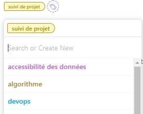
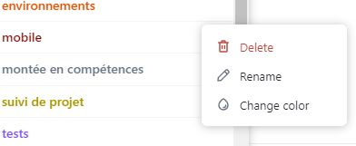

# Categories  

Categories represent the tags that can be given to tickets. They allow the members of the group to more simply understand and sort the tickets.

⚠️ **Important: a ticket must always have a tag.**

In order to know which tag to give to your ticket here is a list of existing tags for a ticket and their meaning :

  - `base de donnée` : Ticket to work on the database
  - `algorithme` : Ticket to work on artificial intelligence and its algorithm
  - `devops` : Ticket to work on the devops part
  - `environnements` : Ticket to setting up a working environment or improving it
  - `montée en compétences` : Ticket to increase your skills in a specific area (the area must be specified in the name of the ticket)
  - `suivi de projet` : Ticket to follow the management of the group and improve it
  - `tests` : Ticket to add test or unit test on apps
  - `mobile` : Ticket to work on the mobile part
  - `web` : Ticket to work on the web part

You can also create a new tag if it seems necessary. Be careful to not create too much tags which could confuse and remove the usefulness of putting them.

To create a new tag, write a name for the new tag and press `Enter` on keyboard.

You can also rename a tag, change its color or delete it.

🎉 Congratulations, you now know how to create a tag and effectively choose a tag for your tickets.