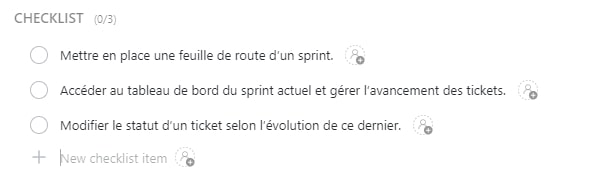

# ClickUp

## Summary

ClickUp is a cloud-based work platform for all types and sizes of teams and businesses. It combines important business applications and centralizes company information into a single online solution. Assign tasks to team members and manage projects.

# Guide

## Connect to ClickUp

Login or Register to [Clickup](https://app.clickup.com/) to access the project board.

## Create a new ticket

To create a new ticket click on the `+` button make sure to give it a consistent name defining the task to be performed.

After that, you will have to fill in all the necessary elements to create a valid ticket :

- [**Assignment**](#assignment)
- [**Priority**](#priority)
- [**Tags**](#tags)
- [**Fields**](#fields)
- [**Checklist**](#checklist)
- [**Due Time**](#due-time)

All this information can evolve over the sprint.

### Assignment

The assignment of the task can be done later, for example after a kick-off or when a member of the group decides to start the task

### Priority

Meaning of priorities :
 - Urgent : A bug that needs to be fixed immediately because it slows down or stops the progress of the project / A late ticket that needs to be completed immediately
 - High : A task that is part of the MVP or a ticket to be completed for the end of the current sprint
 - Normal : A ticket created to be placed in backlog
 - Low : A ticket aiming to be future features to add to the project
 - Clear : A completed or abandoned ticket

You will have to modify the priority of the same ticket several times depending on its status during the project.

### Tags

In order to properly select the tags for your ticket, refer to [category](categorie.md).

### Fields

⚠️ **Important: don't forget to add your estimated J/H.**

### Checklist

The assigned tasks must correspond to the tasks defined in the PLD of the corresponding sprint

### Due Time

