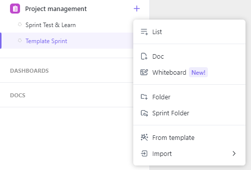
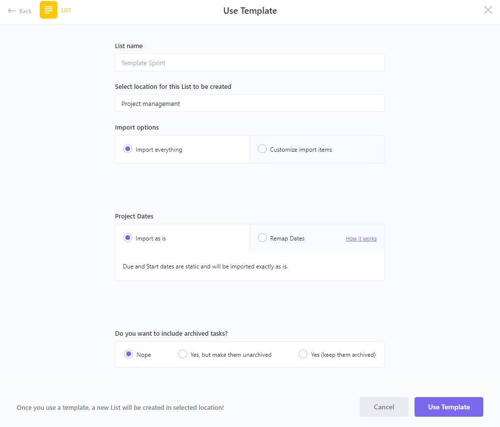
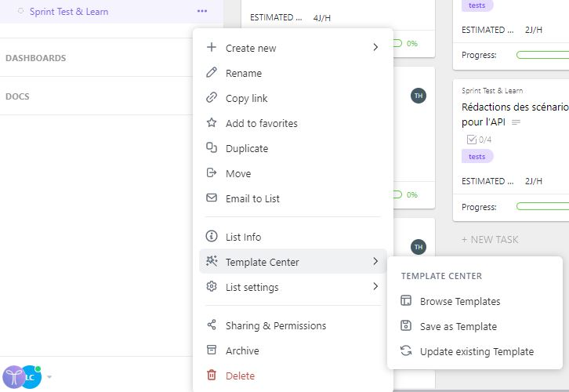
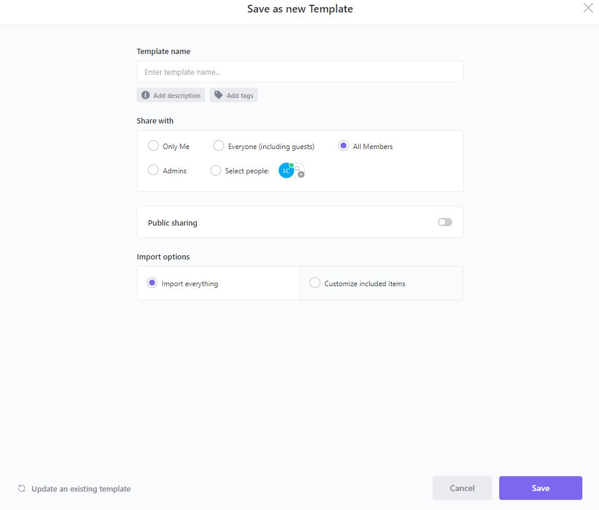

# Schedule 

## Create a new schedule

As a project manager, you will have to create and manage a follow-up schedule from the ClickUp web application.
In this guide you will learn how to create a schedule for a sprint.

## Use template schedule

To create a new schedule, click on `+` button to the right of your workspace and select `From Template`.

In the `Innuendo Template` window, check the `List` box to display the template `Template Sprint` and select them. Be sure to give a name to the sprint, select the correct location and import all options.

In this template you will have a board already built with the different ticket statues. Congratulation, you have created a new schedule, you can now add tickets to it.

🎉 Congratulations, you have now created a new schedule to start your sprint and track the progress of your sprint.

## Save a new template

In order to save a schedule as a new template go to the options of the desired schedule and select `Save as Template` in `Template Center` 

Name your template, add a description and define the accessibility of your template. Be sure to import all schedule options used to create the template.

🎉 Congratulations, you have now created a new schedule template that will be useful for creating schedules for your next sprints.