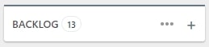
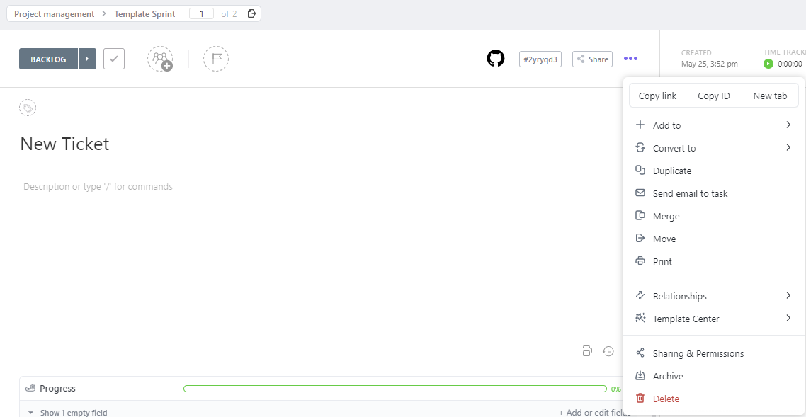
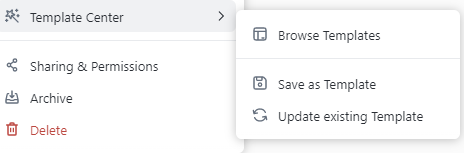
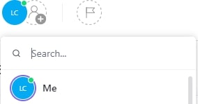
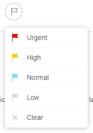
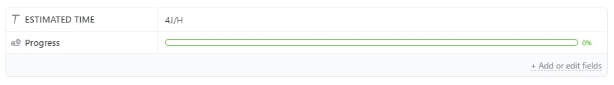
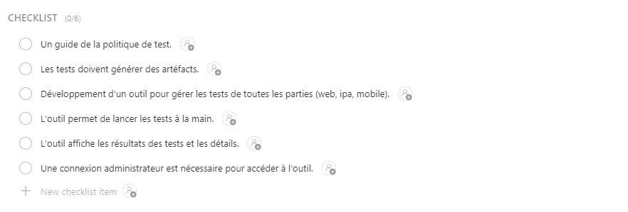
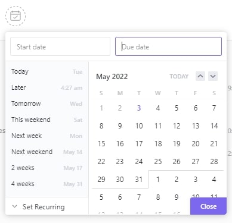

# Ticket 

## Create a new ticket

To create a new ticket click on the `+` button and make sure to give it a consistent name defining the task to be performed.

After that, if you are a project manager you can create a ticket and create a template from the ticket to make it easier for developers

If you are a developer you can load the Innuendo ticket template in order to have the field for the estimated time in man-days and the automatic assignment of your project manager. Be sure to import all options.

In the ticket options click on Template Center

Click on `Browse Templates` to select `Innuendo Template Ticket` and load the template
Clikc on `Save as Templates` to save the current ticket as a template ticket 

After that, you will have to complete all necessary elements if it is not done yet to create a valid ticket :

- [Assignment](#assignment)
- [Priority](#priority)
- [Tags](#tags)
- [Fields](#fields)
- [Checklist](#checklist)
- [Due Time](#due-time)

All this information can evolve over the sprint.

### Assignment

The assignment of the task can be done later, for example after a kick-off or when a member of the group decides to start the task

### Priority

Meaning of priorities :
 - Urgent : A bug that needs to be fixed immediately because it slows down or stops the progress of the project / A late ticket that needs to be completed immediately
 - High : A task that is part of the MVP or a ticket to be completed for the end of the current sprint
 - Normal : A ticket created to be placed in backlog
 - Low : A ticket aiming to be future features to add to the project
 - Clear : A completed or abandoned ticket

You will have to modify the priority of the same ticket several times depending on its status during the project.

### Tags

In order to properly select the tags for your ticket, refer to [categories](categories.md).

### Fields

⚠️ **Important: don't forget to add your estimated J/H.**

### Checklist

The assigned tasks must correspond to the tasks defined in the PLD of the corresponding sprint

### Due Time

It is important to add a due date to the ticket in order to update the priority of the ticket